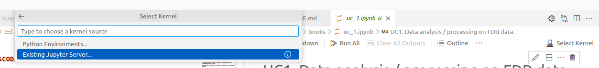

# FDB and Polytope model data access and processing using meteodata-lab, example notebooks

This repository contains all that is required to install and run various Jupyter notebooks which demonstrate the simplified access to model data via [FDB](https://github.com/ecmwf/fdb), the [Polytope server](https://github.com/ecmwf/polytope-server) and the [Polytope library](https://github.com/ecmwf/polytope) (ECMWF), and then the subsequent post-processing via a data processing framework [meteodata-lab](https://github.com/MeteoSwiss/meteodata-lab) (in development). The following use cases are covered by the notebooks:

* Retrieving a specified selection of GRIB fields into an xarray object and processing with meteorological operators.
* Remotely retrieving a very reduced subset of GRIB fields, eg just a few grid points, via the Polytope algorithm, to create a timeseries over an extended period.
* Writing GRIB fields data back to FDB having processed the model data at CSCS.
  
The notebooks for the demo can be found in the directory [notebooks](notebooks).

## Jupyter Notebooks

Notebooks to run from CSCS (Balfrin):
- 1_Data_Retrieval_from_FDB_Preprocessing
- 2_Precompute_and_Store_Echotop_to_FDB

Notebooks to run from the LabVM:
- 3_Retrieve_Echotop_and_Regrid
- 4_Location_and_TimeSeries_Access

**Forecasts available in FDB**

> [!NOTE]
> The realtime FDB normally contains **just the two latest forecasts**. This means the FDB requests in the notebooks should usually use date = today and time as either 0000, 0300, 0600, 0900 etc. (given the forecasts run every 3 hour). The data is usually available in the FDB a couple of hours after the forecast start time. If the requests to FDB return no data, see these [instructions](https://meteoswiss.atlassian.net/wiki/spaces/IW2/pages/144150401/Realtime+FDB+ICON-CH1#Query-available-data-on-Balfrin) for how to query yourself which data is currently archived in the FDB, or contact victoria.cherkas@meteoswiss.ch.

> [!NOTE]
> Only a single service account can write data to the aforementioned FDB. This means that the writing of computed GRIB fields in notebook 2 (2_Precompute_and_Store_Echotop_to_FDB) cannot be run by any user on CSCS. Subsequently the reading of this same data on the LabVM in Notebook 3 (3_Retrieve_Echotop_and_Regrid) would only work when notebook 2 was run under this specific service account. Please contact victoria.cherkas@meteoswiss.ch or christian.kanesan@meteoswiss.ch to see the demo in full. Alternatively you can create your own FDB and write back to this.

## Making Changes

When modifying the notebooks, work in the `notebooks` directory.

In order to create snapshots based on the current status of the notebooks in the `notebooks/snapshot` directory, run

```
sh make_snapshot.sh
```

Before submitting, also clear the output of the working version of the notebooks. This makes merges and reviews easier as they do not
also include the much larger diffs to the output. Jenkins will also ensure that the working notebooks have been cleared before allowing
to merge a pull request. To clear notebooks and snapshot run

```
sh make_snapshot.sh -c
```

# Instructions

To use the Jupyter notebooks you have the following two options regarding the runtime dependencies and the jupyter server:

1. Jupyter server on the lab-vm or at CSCS (Balfrin) and runtime dependencies in a container
2. Both the jupyter server and the runtime dependencies in a container (LabVM only)

##   Jupyter server on the Lab-VM or at CSCS (Balfrin)
#### LabVM

With this approach you define a kernel definiton in your jupyter server with a reference to the container.
```sh
sudo apt install pipx
export REQUESTS_CA_BUNDLE=/etc/ssl/certs/ca-certificates.crt
pipx install jupyterlab

./host/install_kernel.sh
```
Connect to the jupyter server <br>
- **from VSCode:** <br>
Open the notebook and select the `polytope-demo` kernel in "Select Kernel" -> "Select another Kernel..." -> "Jupyter Kernel..." <br>
- **from your browser:**
  ```sh
  pipx run jupyter lab --port 8080
  ```
  Open the URL given in the code and select the `polytope-demo` kernel.

#### CSCS (Balfrin)

Setup spack for the machine and build FDB.

```sh
spack env activate -p spack-env
spack install --no-checksum
```

Setup the python environment.

```sh
conda env create -n demo -f environment.yaml
conda activate demo
git clone -b mars-levtype-echotop-2 https://github.com/cfkanesan/eccodes-cosmo-resources.git $CONDA_PREFIX/share/eccodes-cosmo-resources
pip install jupyterlab
python -m jupyter lab
```

Use VSCode to forward the port that is binded to the jupyter lab server to your local machine and open the link in the jupyter lab server logs.
Ctrl-C once to show the link again.

##   Jupyter server in a container (LabVM only)
With this approach you have both the Jupyter server and the runtime dependencies in a container.

```sh
podman run \
  -e https_proxy=$https_proxy \
  -e REQUESTS_CA_BUNDLE=/etc/ssl/certs/ca-certificates.crt \
  -e SSL_CERT_DIR=/etc/ssl/certs/ \
  --network=host \
  --rm \
  dockerhub.apps.cp.meteoswiss.ch/numericalweatherpredictions/polytope/demo/notebook:<TAG>
```
`<TAG>`:The current container tag can be retrieved from: [https://nexus.meteoswiss.ch/nexus/service/rest/repository/browse/docker-all/v2/numericalweatherpredictions/polytope/demo/notebook/tags/](https://nexus.meteoswiss.ch/nexus/service/rest/repository/browse/docker-all/v2/numericalweatherpredictions/polytope/demo/notebook/tags/)

Afterwards connect to the external Jupyter server from the notebook with the url from container log. Click "Select Kernel" -> "Existing Jupyter Server..." and then paste the url form the container log.



> [!NOTE]
> With VSCode, you need to have the `Jupyter` VSCode extension (https://marketplace.visualstudio.com/items?itemName=ms-toolsai.jupyter) insalled.
